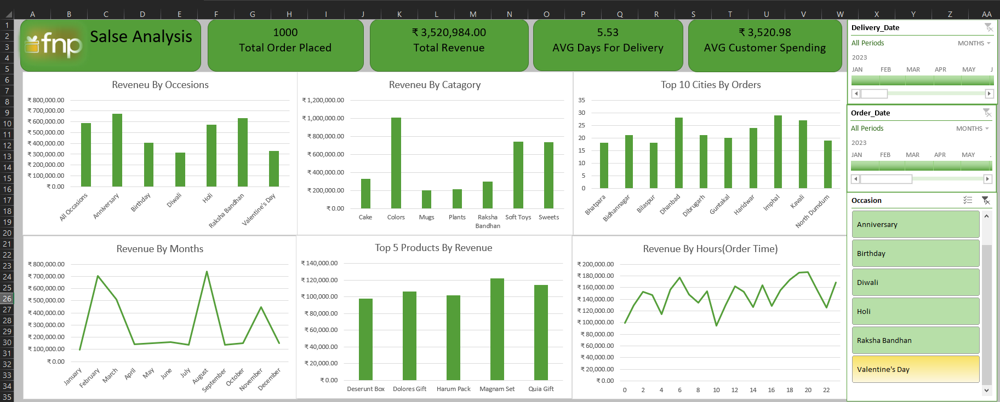

# FNP-Sales-Analysis-Dashboard

## Dashboard Preview

## Executive Summary

The FNP Sales Analysis Dashboard is a data analytics project designed to provide business insights into sales performance, customer behavior, delivery efficiency, and product trends. The dashboard transforms raw transactional data into clear visual metrics that help stakeholders quickly understand revenue patterns, top-performing categories, and operational performance.

This project focuses on converting complex datasets into decision-ready analytics using Excel data modeling, pivot tables, and interactive slicers. The goal is to help management identify peak sales occasions, optimize delivery timelines, and improve product strategy through data-driven insights.

## Project Highlights

- Built an interactive Excel dashboard using Data Model relationships
- Designed KPI cards for executive-level reporting
- Implemented slicers & timeline filters for dynamic analysis
- Converted raw transactional data into business insights

## Project Objectives

Analyze overall sales performance and revenue trends

Identify top revenue-generating product categories and occasions

Monitor delivery efficiency through average delivery days

Understand customer spending behavior

Provide an interactive dashboard for business decision-making

## Key Performance Indicators (KPIs)

The dashboard highlights several high-level business metrics:

Total Orders Placed: 1000

Total Revenue: ₹3,520,984.00

Average Delivery Time: 5.53 days

Average Customer Spending: ₹3,520.98

These KPIs provide a quick overview of operational and financial performance.

## Dashboard Features

1️⃣ Revenue by Occasion

Analyzes revenue generated during different events such as Anniversary, Birthday, Holi, Diwali, and Raksha Bandhan.
Helps identify seasonal demand patterns and marketing opportunities.

2️⃣ Revenue by Category

Breaks down revenue across product categories:

Cake

Colors

Mugs

Plants

Raksha Bandhan Items

Soft Toys

Sweets

This allows stakeholders to understand which product lines drive the most sales.

3️⃣ Revenue by Order Hour

Tracks order distribution based on time, helping businesses optimize staffing and promotions during peak hours.

4️⃣ Revenue by Months

Shows monthly revenue trends to identify seasonal spikes and slow periods.

5️⃣ Top Products by Revenue

Highlights best-selling products contributing the most revenue, helping improve inventory and marketing strategies.

6️⃣ Top Cities by Orders

Provides geographic insights into customer demand across cities.

## Tools & Technologies Used

- Microsoft Excel
- Power Query (Data Cleaning & Transformation)
- Power Pivot (Data Modeling & Relationships)
- DAX (Measures)
- Pivot Tables & Pivot Charts
- Slicers & Timeline Filters
- Business KPI Design

## Data Modeling Approach

The project uses a structured data model where multiple tables are connected through relationships.
This allows:

Efficient filtering

Dynamic reporting

Cross-table analytics

## Key Insights

Certain occasions generate significantly higher revenue, indicating strong seasonal buying behavior.

Specific categories such as Colors and Soft Toys show strong sales contribution.

Monthly analysis reveals peak demand periods that could guide promotional campaigns.

Delivery time averages around 5.5 days, highlighting operational performance.

## How to Use the Dashboard

Open the Excel dashboard file.

Use the Delivery Date, Order Date, and Occasion slicers on the right panel.

Select filters to dynamically update all charts and KPIs.

Analyze trends across categories, months, and locations.

## Author

Rim Jhim
CSE Student | Data Analytics Enthusiast
